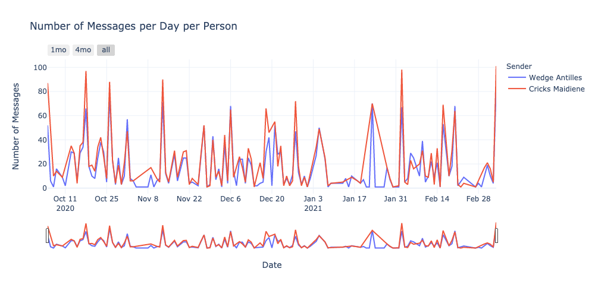
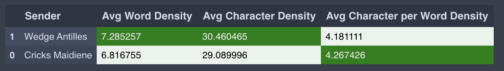
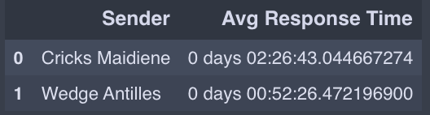
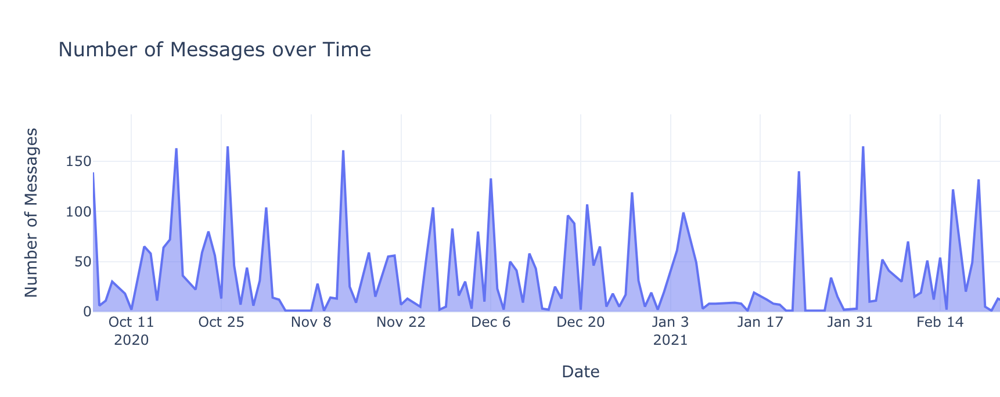

# Exploratory WhatsApp Chat Analysis

- [Exploratory WhatsApp Chat Analysis](#exploratory-whatsapp-chat-analysis)
  - [About](#about)
  - [Gallery](#gallery)
  - [Setting Up](#setting-up)
  - [Executing the Notebook](#executing-the-notebook)
  - [Flow of Execution](#flow-of-execution)
  

## About

* Analyze summaries of your WhatsApp chats with individuals or groups.
* No data is stored or sent outside your system of execution. All chat data is deleted from memory once the insights are generated. Jupyter notebooks are used so that the code generating the summaries can be viewed by the skeptical user.
* Load up your individual chats and look up metrics such as response time, text density, number of emojis, etc.

## Gallery

</img>





## Setting Up

* Recreate conda environment using the following

```bash
$ git clone https://github.com/cricksmaidiene/whatsapp_chat_analysis.git
$ cd whatsapp_chat_analysis
$ conda create --name whatsapp_chat_analysis --file env.txt
$ conda activate whatsapp_chat_analysis
```

Then run either:
```
jupyter lab
```

or
```
jupyter notebook
```

Either of the following are the jupyter requirements & versions:

* `jupyterlab==2.2.6` requires `jupyter labextension install jupyterlab-plotly@4.14.3`, in turn requires `nodejs >= 10.0`. Install nodejs with `conda install nodejs -c conda-forge --repodata-fn=repodata.json`
* `jupyter notebook==6.2.0`

## Executing the Notebook

* To export a WhatsApp chat as a `txt` file in either iOS or Android, go to a particular chat with a person or group and check the options. There is an option to export chat. Select `Without Media` and save the resulting text file in the same directory as the notebook.
* Modify the second cell of the notebook with the chat `txt` filename / filepath. This highlights to the notebook on which chat file is to be analyzed.
* Run all cells

## Flow of Execution

* Text file is loaded, cleaned up and parsed. The messages are turned into a table (or dataframe) at a per-message level.
* Once the dataframe is created, it is aggregated and re-aggregated for different analyses and visualized using plotly express.